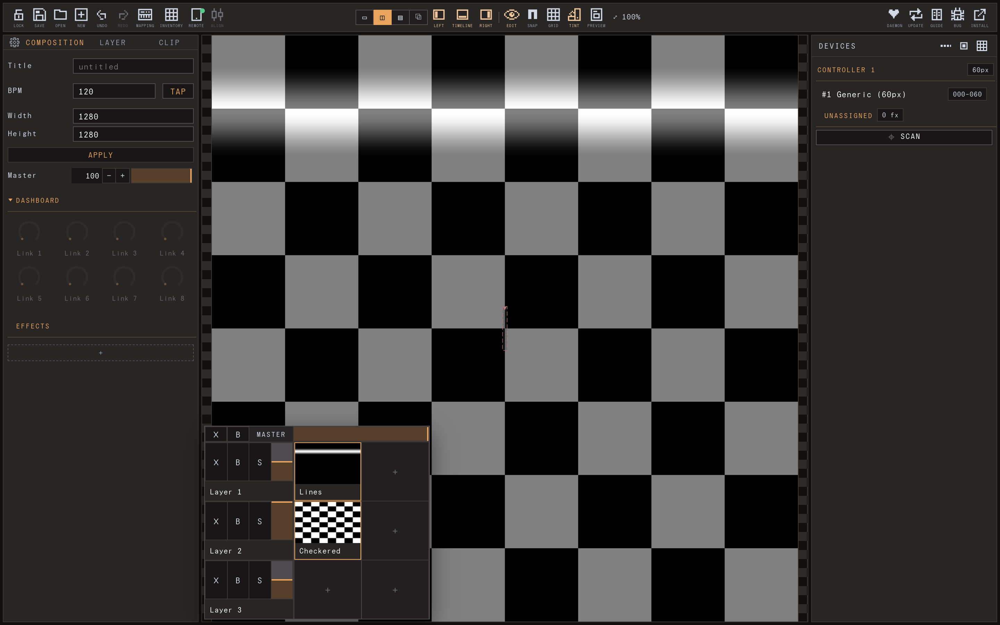
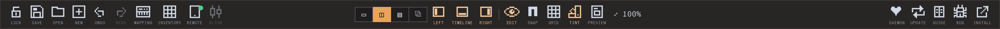

# What is LED Zeppelin

LED Zeppelin drives **addressable LED** (strips, polylines, snake-wired matrices) with live
generative visuals. You design moving imagery on a 2D canvas, place your lights on that
canvas, and the app streams the right colours to each light in real time (~40 fps).

Think projection-mapping, but the "surfaces" are LED **fixtures** and the output is network
pixel data, not a video signal.

## Two halves

LED Zeppelin is **a browser editor + a small background daemon**:

- **Editor** — runs in a browser. Design, map, configure. Open it hosted at
  [ledzeppelin.jonasjohansson.se](http://ledzeppelin.jonasjohansson.se/), or locally via the
  app (`http://localhost:7070`).
- **Daemon** — the local program that sends the network packets (UDP) a browser can't, scans
  for controllers, and receives OSC/MIDI.

**Design anywhere; to light real LEDs, run the local app.** The hosted site previews but can't
stream — only the local daemon talks to hardware.

## What you can do

- **Design** — stack generative clips and effects on a layer; modulate any param by time,
  audio, or OSC/MIDI. ISF shaders work too (drop one in as a clip or effect).
- **Map** — place **fixtures** on the canvas to set what each one samples.
- **Output** — wire fixtures to **devices** (controllers); stream over DDP (WLED) or Art-Net.
- **Operate** — save/recall looks as **scenes**; control live via MIDI, OSC, keyboard, or a
  phone companion.

It uses **scenes** (recallable snapshots), not a cue list. The released app needs no Node.js.

## The top bar

A single row of icon buttons (with tiny uppercase captions), grouped left to right:

- **Project** — lock (performance mode), save (⌘S), open (⌘O), new, undo/redo.
- **Mapping** (mapping icon) and **Inventory** (grid icon) — each opens as a **browser tab**.
  The Inventory tab also hosts *import from LEDger*.
- **Control surface** (phone remote), **align**, and **view presets** —
  Canvas / Split / Editor / Float — plus the panel toggles.
- **Canvas tools** — edit fixtures, snap, grid, tint-by-controller, and **Preview** (the wall
  button: it dims the composite so each fixture lights up only with the pixels it samples).
- **Guide** (book icon) opens this guide; plus refresh, report-a-bug, and install.

The current build version shows in the **browser tab title** (`LED Zeppelin v1.0.x`).

## Loading work

There is no Import button — **drag a file onto the window**:

- an **ISF shader** (`.fs` / `.isf` / `.frag` / `.glsl`) → a new generator clip;
- a **LED Zeppelin project** `.json` → loads the rig *and* visuals;
- a **composition** `.json` → loads visuals only;
- a **LEDger preset** → you're pointed to the **Inventory** tab to import it.

Save the whole project with ⌘S (open with ⌘O); *Save composition…* lives in **Settings**.

New to LED terms? Read [LED control concepts](02-concepts.md). Otherwise jump to
[Getting started](03-getting-started.md).
