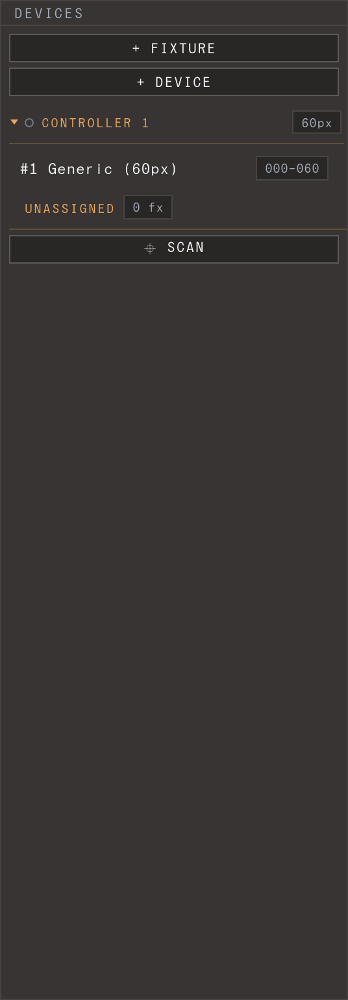

# Getting started: first light

From nothing to one strip lit with live visuals, in ~10 minutes. Read
[LED control concepts](02-concepts.md) first if *device*, *fixture*, and *template* are new.

**You need:** a WLED/QuinLED (or Art-Net) controller, powered on, on the **same network** as
your computer, with a strip wired to it. Plus the app (below). The hosted website previews
only — streaming needs the local app.

## 1. Install & launch

From [Releases](https://github.com/jonasjohansson/ledzeppelin/releases):

- **macOS** — the `macos` `.zip` (`arm64` for Apple Silicon, `intel` otherwise). Unzip → drag
  to Applications → double-click. Notarized, opens normally.
- **Windows** — the `windows` zip → `ledzeppelin.exe` → *More info → Run anyway*. Open `http://localhost:7070`.
- **Linux / Pi** — the `linux` tarball → `./ledzeppelin`. Open `http://localhost:7070`.
- **From source** *(developers)* — `npm install && npm start`.

The app opens in your browser: a **top bar** of tools, the **canvas** and **clip grid** in the
centre, the **Output** panel on the right. The browser tab title shows the version
(`LED Zeppelin v1.0.x`). The daemon runs with the app — when it's reachable the top bar shows
nothing; a red **OFFLINE** chip appears only if it's down. The **Guide** (book icon) reopens
these pages.

> **macOS:** click **Allow** on the Local Network prompt the first time it scans/streams, or
> nothing works.

## 2. Add your controller (device)

A **device** is a physical controller (WLED / QuinLED / Art-Net). Work in the **Output** panel
(the device list) on the right. Its header — the title **Output** — carries three small icons:
**add-fixture**, **add-device**, and **library**.

- **Scan (recommended)** — click **⌖ scan** (under the list). It finds WLED + Art-Net
  controllers and shows live progress; click **ADD** on a result and that controller appears in
  the list immediately, selected. (Scan needs the daemon; the button is disabled until it's up.)
- **Manual** — click the **add-device** icon, pick a model (e.g. DigQuad) or **Blank**, then set
  its **IP** in the editor.

Select the device and set its **colour order** (WLED strips often need **GRB** — if reds/greens
swap, that's why). For pixel devices, **identify** flashes the physical box so you know which is
which. Controllers in the list are **always expanded** — there's no fold.

## 3. Add a fixture

A **fixture** is a mapped light shape on the canvas. Click the **add-fixture** icon in the
Output header and pick a **template** (or **Blank**); templates carry a size, shown in
parentheses. The fixture lands under **Unassigned**, selected, on the canvas.

Fixtures are **standalone** — each owns its own spec. Editing a template later never changes
fixtures already placed. Need many identical strips? Add one, then **duplicate** it. Selecting
several at once **bulk-edits**: shared values show, differing ones dim as "mixed", and an edit
writes to all selected.

## 4. Patch it to the controller

Drag the fixture row onto a controller group in the list (or onto a specific output) to assign
it; pixel addresses pack automatically — no offsets to enter. You can also set **Device** and
**Output (port)** in the editor with the fixture selected. It then moves under that device.
Dragging a fixture back onto **Unassigned** unpatches it.

## 5. Give the canvas something to show

A fixture samples the **canvas**, so it needs visuals or the strip stays dark. The composition
is one layer holding a deck of **clips**; each clip is a source plus an effect chain. The clips
live in the **clip grid** in the centre.

- Click an empty **`+` cell** → a **source** picker opens (grouped: Basic, Pattern, Motion,
  Organic). Pick one (e.g. `noise` or `gradient`) and it becomes a new clip.
- In the deck, **click** a clip to select it (edit it in the inspector), **double-click** to
  trigger it live. The canvas should now show motion.
- You can also **drag** files onto the window (see step 7).

(Full detail: [The canvas](06-canvas-sources-effects.md).)

## 6. See it light up

Daemon up + fixture patched + a clip triggered → the strip shows whatever is under it on the
canvas. Drag the fixture (with the fixture overlay on) to change what it samples. The **preview**
wall button dims the canvas and lights only each fixture's sampled pixels, so you can read the
mapping directly.

**Dark strip? Check, in order:**
1. **Daemon up?** Top-bar Daemon icon — if "offline", relaunch the app (the website can't stream).
2. **Fixture patched?** A fixture left under **Unassigned** isn't wired — assign it (step 4).
3. **Local Network allowed?** (macOS).
4. **Device online?** Its status dot should be green; else check IP/power.
5. **Canvas black?** No triggered clip = nothing to sample (step 5).

More in [Troubleshooting](12-troubleshooting.md).

## 7. Save, open, import

- **⌘S** saves the whole **project** (rig + visuals); **⌘O** opens one.
- **Drag a file onto the window** to load: a LED Zeppelin **project** `.json` (rig + visuals), a
  **composition** `.json` (visuals only), or an **ISF shader** (`.fs` / `.isf` / `.frag` / `.glsl`) → a new
  generator clip. There's no Import button — it's all drag-and-drop.
- **Save composition…** (visuals only) lives in the **Settings** window (the gear at the
  top-left opens it).
- A **LEDger** preset isn't dropped here — open the **Library** window (box icon in the top
  bar, or the library icon in the Output header) and use **import from LEDger / choose preset
  file**. The Library and **Mapping** (mapping icon) open as popup windows.

Capture a look to recall later with [Scenes](07-scenes.md).

---

**The core loop:** add device → add fixture → patch → trigger a clip → output. Everything else
builds on it. Next: [Fixtures & the Library](05-fixtures-and-inventory.md),
[The canvas](06-canvas-sources-effects.md).
