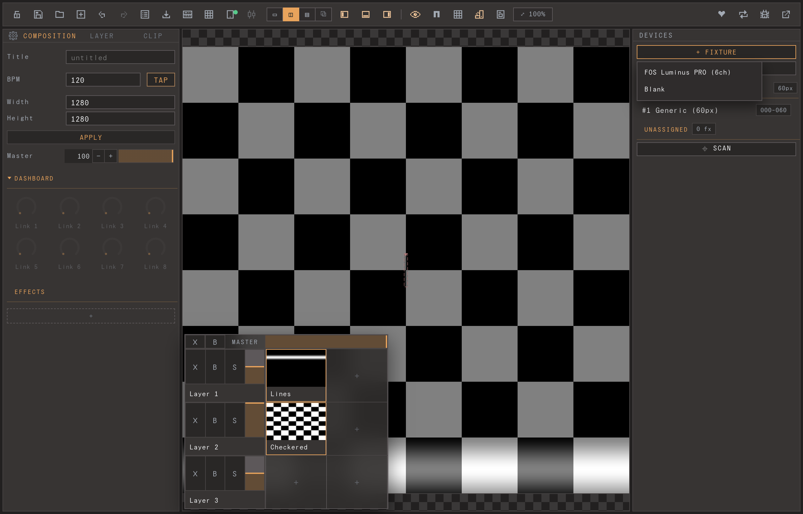
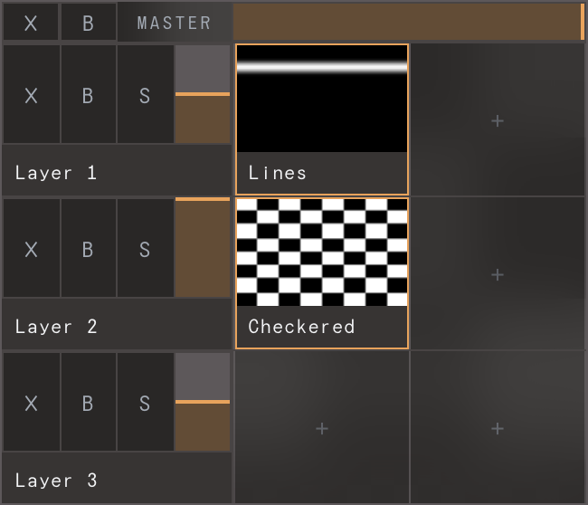

# Getting started: first light

From nothing to one strip lit with live visuals, in ~10 minutes. Read
[LED control concepts](02-concepts.md) first if *device*, *fixture*, and *template* are new.

**You need:** a WLED/QuinLED (or Art-Net) controller, powered on, on the **same network** as
your computer, with a strip wired to it. Plus the app (below). The hosted website previews
only — streaming needs the local app.

## 1. Install & launch

From [Releases](https://github.com/jonasjohansson/ledzeppelin/releases):

- **macOS** — the `macos` `.zip` (`arm64` for Apple Silicon, `intel` otherwise). Unzip → drag
  to Applications → double-click. Notarized, opens normally.
- **Windows** — the `windows` zip → `ledzeppelin.exe` → *More info → Run anyway*. Open `http://localhost:7070`.
- **Linux / Pi** — the `linux` tarball → `./ledzeppelin`. Open `http://localhost:7070`.
- **From source** *(developers)* — `npm install && npm start`.

The app opens in your browser: **top bar** of tools, **canvas** centre, **Devices** panel
right. The daemon runs with the app — confirm via the **health icon** in the top bar (reads
"offline" until it's up).

> **macOS:** click **Allow** on the Local Network prompt the first time it scans/streams, or
> nothing works.

## 2. Add your controller

In the **Devices** panel (right):

- **Scan (recommended)** — click **SCAN** (⌖). It finds WLED + Art-Net devices and lists them;
  click **ADD** and the controller appears in the list, selected.
- **Manual** — **+ Device**, pick a model (e.g. DigQuad), set its **IP** in the editor.

Select the device, hit **identify** to flash the physical box, and set **colour order** (WLED
strips often need **GRB** — if reds/greens swap, that's why).

## 3. Add a fixture

Click **+ Fixture** and pick a template (or **Blank**):

It lands under **Unassigned**, selected, on the canvas. Need many identical strips? Add one,
then **duplicate** it.

## 4. Patch it to the controller

With the fixture selected, set its **Device** and **Output (port)** in the editor (e.g.
DigQuad, output 1). Pixel addresses pack automatically — no offsets to enter. The fixture
moves under that device in the list.

## 5. Give the canvas something to show

A fixture samples the **canvas**, so it needs visuals or the strip stays dark. Visuals live in
the **clip grid** under the canvas — each layer row has clip cells:

Click a **`+` clip cell** in a layer, pick a source from the picker (the bundled ISF examples
are an easy start), and click the clip to make it active. The canvas should now show motion.
(Full detail: [The canvas](06-canvas-sources-effects.md).)

## 6. See it light up

Daemon up + fixture patched + canvas showing visuals → the strip shows whatever is under it.
Drag the fixture on the canvas to change what it samples.

**Dark strip? Check, in order:**
1. **Daemon up?** Top-bar health icon — if "offline", relaunch the app (the website can't stream).
2. **Fixture patched?** An **Unassigned** fixture isn't wired — set device + port (step 4).
3. **Local Network allowed?** (macOS).
4. **Device online?** Its status dot should be green; else check IP/power.
5. **Canvas black?** No active clip = nothing to sample (step 5).

More in [Troubleshooting](12-troubleshooting.md).

## 7. Save

**⌘S** to save, **⌘O** to reopen. Capture a look to recall later with [Scenes](07-scenes.md).

---

**The core loop:** add device → add fixture → patch → map on canvas → output. Everything else
builds on it. Next: [Fixtures & the Inventory](05-fixtures-and-inventory.md),
[The canvas](06-canvas-sources-effects.md).
