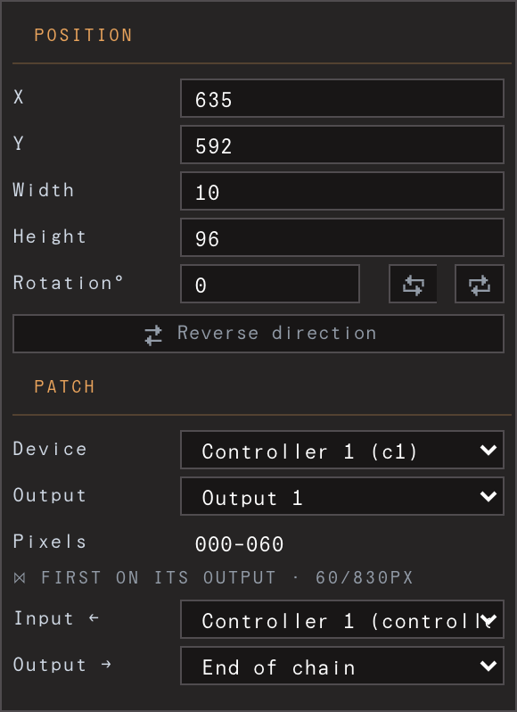

# Fixtures & the Library

The heart of patching: turning physical strips and panels into shapes on the
canvas, and keeping a reusable catalog of the gear you own. Builds on
[Concepts: the three things](02-concepts.md).

## Fixtures vs templates — and why placement is standalone

Three terms, used consistently throughout the guide:

- **Device** — a physical controller (WLED / QuinLED / Art-Net node).
- **Fixture** — a mapped light shape placed on the canvas.
- **Template** — a reusable definition in the **Library** (a fixture *type* or a
  controller *model*).

A template is a starting point, not a live link. When you add a fixture from a
template, the template's spec — pixel count, colour order, grid size, DMX channel
map — is **inlined onto a fresh standalone instance**. The instance keeps a
reference back to the template it came from (so the Library can count how many
copies exist), but every spec field now lives on the fixture itself.

The consequence matters in practice: **editing a template never changes fixtures
you've already placed.** Change a strip type from 60 to 144 LEDs/m in the
Library and your existing strips keep their pixel counts; only the *next*
fixture you stamp from that type picks up the new value. The same rule holds for
devices: a controller instance owns its own outputs / per-output budget and falls
back to the model only for fields it genuinely lacks.

This is deliberate. A show is a record of the real rig — once a fixture is on the
wall, its definition shouldn't shift under you because you tidied the catalog.

## The Library window

The Library opens as its own **popup window** (the box icon in the top bar,
captioned LIBRARY). It's the template library — where you define the gear you
own so you can stamp it repeatedly:

- **Controller models** — a board's physical output count and per-output pixel
  budget (e.g. a QuinLED *DigQuad* = 4 outputs). QuinLED presets (DigUno / DigQuad
  / DigOcta) and a permanent **Generic** model are always present.
- **Fixture types** — reusable physical definitions:
  - **Strips**, by density × length: LEDs/m × metres → pixel count, plus colour
    order (default GRB) and an optional colour format (`RGBW`, etc.).
  - **Matrices / panels**, by columns × rows, wired in a chosen distribution
    (snake / row order). Pixel count is always cols × rows.
  - **DMX-profile fixtures**, defined as a list of named **parameters** (a colour
    block like `RGB`, or a function like Dimmer / Strobe), which expand into a
    flat **DMX channel map**. A generic **Generic** fixture type is always present.

The Library tab also hosts **LEDger import** — *import from ledger / choose
preset file* — which brings a whole rig (controllers + fixtures + layout) in at
once. There is no separate LEDger button in the top bar; the import flow lives
here. See [Importing from LEDger](09-importing-from-ledger.md).

> The Library authors *templates only* — there's no canvas in this tab. Placing
> and patching fixtures happens in the main window (next section). Edits sync
> live between the Library tab and the main app.

## Adding fixtures and devices

In the main window, the **Output** panel header (titled "Output") carries three
small icons — **add-fixture**, **add-device**, and **library**. There are no big
"+ Fixture / + Device" buttons.

Click **add-fixture** and a menu drops down listing your fixture types by name
(with a size hint like `144px` or `16×16` or `7ch`), plus a **Blank** entry at the
bottom. Pick a type to stamp a standalone copy, centred on the canvas and left
**unassigned** (no device yet) so you can patch it deliberately. **Blank** stamps
from the always-present Generic type. **add-device** works the same way against
your controller models, with **Blank** stamping a generic 4-output controller.

The new instance is selected immediately, so its editor opens in the inspector and
the canvas overlay reveals it.

### Duplicate to multiply

To make many identical fixtures, stamp one and **duplicate** it with ⌘D (Ctrl-D)
— or copy/paste with ⌘C / ⌘V. Each copy is placed next to its original (shifted by
the fixture's on-screen width plus a small gap) and appended **contiguously** in
its device's pixel address space, so addressing stays valid. Duplicating is faster
than stamping repeatedly when you've already positioned and patched the first one.
A selected **controller** duplicates too (its settings, not its fixtures).

## The flat fixture editor

Select a fixture and the inspector shows a flat editor in two always-open groups —
**Position** and **Patch** (no fold/collapse, same as the controller list). The fixture's
name is in the title bar.

### Position

- **X / Y** — the bounding box's top-left corner (Figma-style), in canvas pixels.
- **Z** — the whole fixture's height off the canvas plane, in pixels (`0` = flat on
  it). Only *visible* in **3D mode** (below); the output is not affected yet.
- **Width** — the run length on the canvas.
- **Height** — **auto** by default: drawn to physical scale (a 10 mm strip at this
  fixture's pixels-per-metre). The field shows the effective pixels; type a value
  to override, or set `0` (or clear it) to return to auto.
- **Rotation°** — with inline ±90° steppers.
- **Reverse direction** — not a transform flip; it reverses *which end of the strip
  is pixel 0* (the canvas arrow points at pixel 0).

### Patch

- **Device** — the controller this fixture is wired to. The first option is
  *— unassigned —*, so a fixture can sit deviceless while you prototype.
- **Output** — the controller's output/port, limited to that device's actual
  output count.
- **Pixels** — a read-only display of the fixture's device-local pixel range.

> **Chains.** If fixtures are daisy-chained on one output, the run's device and
> output are set by the **head** (first) fixture; downstream members inherit them
> and their pickers are locked. Moving the head moves the whole run together.

## 3D mode (beta)

The **3D** cube in the top bar switches the stage to a 3D viewport: a ground grid
with the canvas rectangle on it (the plane the visuals live on), every fixture as
a projected strip, and its live LED colours. Set a fixture's **Z** and it lifts
off the plane.

- **Drag** orbits the view, **Shift-drag** pans, the **wheel** dollies in/out.
  The view is remembered but never enters undo history — it's a camera, not an edit.
- **Click** a strip to select it. 2D editing gestures (move/resize/rotate/vertices)
  are disabled while in 3D — arrange in 2D, inspect in 3D, for now.

**Honest limits today:** 3D mode is a *viewport*. The output still samples the
composition **flat-front** — exactly as in 2D — so toggling modes (or setting Z)
changes nothing on the LEDs yet. Per-vertex 3D editing, bezier arches and a
placeable projection camera (which will make depth affect the mapping) are the
next phases.

### DMX-profile fixtures

A DMX fixture gets a different editor. **Fixture** shows its type (its channel
layout is owned by the type — edit it in the Library) and the on-canvas
footprint (X/Y/W/H — the box is where it *samples* colour, independent of the
channel layout). **Patch** sets the **Controller**, **Universe**, and **Address**,
and shows a footprint badge (`Nch · U{universe}.{address}`).

Below that, **Parameters** gives one row per parameter (an RGB block is one row,
not three). Each parameter picks a **source**: *Canvas* (sample the visual,
default for colour), *Manual* (a fader), a *Layer*'s level, or a *Dashboard* link.

## Multi-select bulk edit

Select several fixtures and the editor becomes a **bulk editor** over the whole
selection. A field whose value is the **same** across every selected fixture shows
that value; a field that **differs** renders as **"— mixed —"** and dims (the row
greys out). Typing into any field — or choosing from a dropdown — writes that value
to **all** selected fixtures at once.

Bulk Position covers X / Y / Width / Height / Rotation (with ±90° and Reverse
applied per-fixture). Bulk Patch covers Device for the whole selection, Output port
when the selection includes strips, and Universe / Address when it includes DMX
fixtures. When every selected fixture is a DMX fixture of the *same* type, a shared
**Parameters** section drives one named fader across all of them. (Per-chain
settings and the derived pixel range aren't bulk-editable.)

The Align corner button (active with 2+ selected) aligns and distributes the
selection against either the other selected fixtures or the composition.

## Patching & auto-packed offsets

You never hand-author a fixture's pixel offset. Each output's run is packed
**automatically**: within a device, fixtures are ordered by (port, then list
order) and assigned **contiguous** device-local offsets starting at 0. Each port's
pixels are contiguous, and ports pack in ascending order — exactly how a
multi-output controller (e.g. a QuinLED DigQuad) lays its outputs into one pixel
array.

This re-packs whenever a fixture's device, port, count, or membership changes — so
assigning a fixture to a device (via the Patch picker, or by **dragging** its row
onto a controller header in the Output panel) can't leave gaps or overlaps. The
read-only **Pixels** range you see is the result of this packing.

Controllers in the Output panel are **always expanded** — fixtures appear nested
under their controller, with an *Unassigned* group for any not yet patched.

---

To verify your patch looks right on the wall, use **Preview** (the wall button):
it dims the canvas and lights only each fixture's sampled pixels.

_See also: [Getting started](03-getting-started.md) · [Devices & scanning](04-devices-and-scanning.md) · [Importing from LEDger](09-importing-from-ledger.md)._
