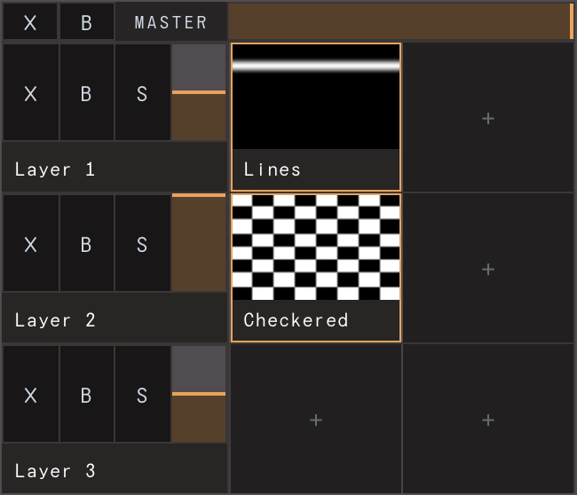
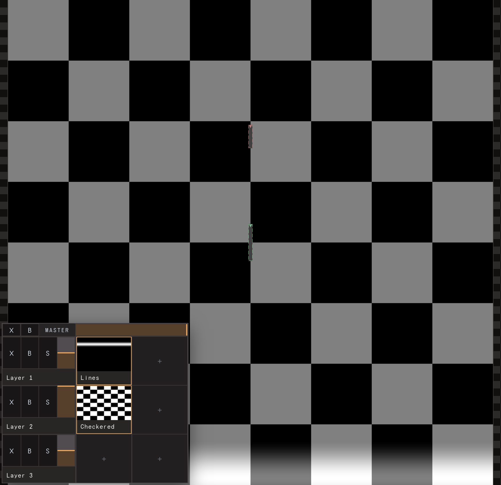

# The canvas: sources & effects

This is where you make the picture. Fixtures don't generate light on their own —
they **sample** a shared canvas, and everything in this page is about painting
that canvas: pick a source, shape it with parameters, stack effects, and make it
move. The mapping side (which pixels each fixture reads) lives in
[Mappings](08-mappings.md); see [concepts: pixel mapping](02-concepts.md) for the
big picture.

## The composition and the canvas

The **composition** is the whole visual show: a canvas of a fixed pixel
resolution plus everything painted on it. Canvas resolution and the composition
title sit at the top of the Composition group; fixtures are placed in canvas
pixel space, so the canvas size is the coordinate system your whole rig lives in.

The composition holds **one layer**. This is a single-layer clip composer, not a
multi-layer VJ stack — you build looks by switching between clips and stacking
effects, not by piling up layers. (The model still stores a `layers` array of
length one so saved shows and the compositor keep working, and a layer's blend /
opacity / crossfade controls exist, but the everyday workflow is one layer + a
deck of clips.)

## The clip grid

The layer holds a **deck of clips** laid out as a grid. Each clip is one
**source** (a generator) plus its parameters plus an effect chain. Only one clip
is **active** (playing) at a time; switching clips crossfades over the layer's
transition time.

Two distinct interactions on a cell:

- **Click** a clip → *select* it. Selecting loads the clip into the inspector
  (source params, transform, effects) without changing what's on the wall.
- **Double-click** a clip → *trigger* it. The compositor crossfades to that
  clip's source.

A trailing **empty cell with a `+`** always sits at the end of the deck.

### Add a clip via the `+` cell

Click the `+` cell to open the **source picker** — a small popover anchored to
the cell. It's grouped for quick scanning:

- **Basic** — Color, Gradient, Lines
- **Pattern** — Grid, Checkered, Spectrum
- **Motion** — Sine, Pulse, Radial
- **Organic** — Noise

Below the built-ins, an **ISF** group lists any bundled example shaders, and a
**`+ video…`** entry lets you load a video file as a clip. Pick a source and a new
clip is created and selected.

You can also **drag** a source onto a cell from a drag operation: dropping a
source onto the `+` cell makes a new clip; dropping it onto an existing clip
*replaces* that clip's source (keeping its slot). Drag a clip between cells to
reorder it.

## Sources

Sources are the generators that draw the base image. The built-in set:

| Source | What it draws |
| --- | --- |
| **Color** | Solid colour × brightness — the go-to wash. Optional Kelvin white-balance mode (warm→cool by temperature). |
| **Gradient** | Two-stop colour ramp along an angle. |
| **Lines** | A soft line that sweeps about the canvas centre (position, width, angle, speed, amplitude). |
| **Sine** | A definable sine field with FM modulation, scroll speed, and crest sharpening. |
| **Grid** | Cols × rows cells outlined by lines — align fixtures to a known grid. |
| **Checkered** | Alternating black/white cells (cols × rows) — the go-to pattern for verifying the fixture mapping over the install. |
| **Pulse** | A *triggerable* beam: a head of light that travels across the canvas leaving a decaying trail. Fire it with the ⚡ button, or enable autoFire to loop. |
| **Radial** | A *triggerable* ring expanding from the centre (the in-the-round twin of Pulse). |
| **Noise** | Animated fbm value noise (clouds), mapped between two colours. |
| **Spectrum** | A rainbow sweep of hue cycles along an angle. |

Each source exposes its own parameters in the inspector's **Source** section,
auto-generated from the shader manifest (sliders for numbers, a colour well for
colours, a checkbox for booleans). Right-click a slider to reset it to default;
the **↺** in the section header resets all source params at once.

**Triggerable** sources (Pulse, Radial) show a ⚡ badge on their clip thumbnail
and a prominent **⚡ trigger** button at the top of the inspector — press it to
fire a beam/ring.

### Volumetric sources

The picker's **Volumetric** group holds four sources that don't draw on the
canvas at all — they're 3D **fields** evaluated at each LED's world position
(x, y across the canvas, z = height off the canvas plane) in the sampler pass,
then blended onto the sampled colour with the layer's blend mode + opacity:

| Source | What it lights |
| --- | --- |
| **Plane Sweep** | A coloured band around a plane ⊥ a chosen axis (x/y/z) at `pos` — animate `pos` on z and the band climbs a standing arch. |
| **Axis Gradient** | A two-colour ramp along an axis, scrollable (wraps). |
| **Noise 3D** | fbm value noise in space — organic volume shimmer. |
| **Sphere Pulse** | A radial shell from a point in space; *triggerable* — each ⚡ fires an expanding shell. |

They live in the deck like any clip (same triggering, params, animation,
MIDI/OSC mapping) and show a **3D** badge on their thumbnail. Honest limits in
v1: at most **4** volumetric clips can be active at once (extras are ignored),
they have **no effect chain**, and they switch instantly (no crossfade). The
`axis` param is numeric: 0 = x, 1 = y, 2 = z. In a 2D show (or with the Flat
projection) every LED sits at z = 0, so a z-plane sweep acts as a global fade
as it crosses 0 while x/y fields sweep across the rig — coherent, not a bug.
The flat canvas view shows no volumetric contribution (correct — it isn't on
the canvas); the **3D viewport** and the wall **Preview** are where they read.

Beyond the built-ins, LED Zeppelin runs **ISF** shaders (the Interactive Shader
Format). Two ways to add one:

- **From the picker** — pick an entry under the source picker's **ISF** group to
  import a bundled example as a clip.
- **By drag-and-drop** — drag an `.fs`, `.isf`, `.frag`, or `.glsl` file onto the
  window. It's imported as a **new generator clip**, landing on the layer/clip
  cell under the cursor (drop near a clip to control where it goes). If the shader
  is a *filter* (it samples an input image) it's instead appended as an **effect**
  on the clip under the drop.

ISF inputs become editable parameters in the **Source** section, just like the
built-ins — floats, integers, booleans, and colours get rows; an `image` input
gets a file picker for a texture.

## Effects

Effects process the image after the source. Each clip has its own **effect
chain** in the inspector's **Effects** section; effects run top to bottom.

- **Add** — click the `+` at the bottom of the Effects section to open the effect
  picker, or **drag** an effect onto a clip cell to append it there.
- **Reorder** — drag an effect block's header up/down within the chain.
- **Select / delete** — click an effect's header to select it (Backspace deletes
  the selected effect), or use the **✕** in its header menu.
- **Presets** — each effect (and each source) header carries a small menu: save
  the current params as a named preset (**⤓**), load one (**▾**), and reset (**↺**).

The built-in effects:

| Effect | Does |
| --- | --- |
| **Displace** | Horizontal noise displacement. |
| **Repeat** | Tile the image horizontally. |
| **Strobe** | Gate the image on/off at a rate. |
| **Trails** | Bright pixels leave decaying streaks (feedback). |
| **Feedback** | Zoom/rotate the faded last frame — infinite-tunnel / droste motion. |
| **Segmenter** | Split an axis into N segments, pass only a chosen range. Maps content to physical column groups. |
| **Cascade** | Split into N bands and time-delay each along travel — a staircase cascade (the in-visual twin of fixture chains). |
| **Hue** | Rotate hue (static shift and/or auto-cycle). |
| **Adjustments** | Bundled gamma → brightness → contrast → saturation grade. |
| **Invert / RGB / Threshold / Colorize** | Per-channel and luminance grades; Colorize tints any grayscale source between two colours. |

There are also **layer** and **composition** effect chains for effects that
should apply to the whole layer or the final composite (all in their respective
inspector sections), but the per-clip chain is where most work happens.

## Parameter modulation

Almost any numeric parameter can be **modulated** instead of held static. Each
such row has a **cog (⚙)** that opens a mode menu:

- **Basic** — hold a single value (the plain slider), or sweep between an **in**
  and **out** value on a dual-handle range track.
- **Timeline** — an LFO across the clip: a base waveform (saw / sine / square /
  random sample-and-hold / smooth noise), with independent **reverse** and
  **bounce** (ping-pong) toggles. Duration is free **seconds** or **beat-synced**
  to the composition tempo (the `s`/♪ unit toggle); beat-synced loops show their
  beat grid as ticks on the track.
- **Dashboard** — follow one of the global **Dashboard** link knobs (a 4×4 grid in
  the Composition inspector). One knob can drive many params at once; **invert**
  flips the mapping.
- **Audio Ext.** / **Audio Comp.** — follow a frequency **band** of a hardware
  audio input, or of the composition's own clip audio. Pick the band and a gain.

When a param is animated, the row becomes an in/out range track with a live
marker that the render loop slides along, plus a live numeric readout. Grab a
track handle to type an exact in/out value. The clip thumbnail shows small badges
— **T** (a param runs on the timeline), **A** (follows audio), **E** (follows an
external channel) — so the deck tells you at a glance which clips are driven.

### External control (OSC / MIDI)

Any routable parameter can be driven from **outside** the app. Rather than a
dedicated menu entry, you bind a param to an incoming OSC/MIDI channel in
**System › Mapping** (see [Mappings](08-mappings.md)); the cog menu's **Control**
tick additionally publishes a parameter to the phone Companion / Control surface.
Each routable param carries a canonical OSC address you can copy.

## Preview: seeing what the wall samples

The top bar's **Preview** button (the wall icon, captioned *Preview*) flips the
canvas into wall view: it **dims the canvas** and lights only the pixels each
fixture actually samples, at full strength. Where the visuals cross a fixture,
that fixture's LEDs glow; everywhere else stays dark context. It's the honest
answer to "what will the install look like?" — only the sampled pixels, nothing
else.

Preview is CSS-only over the live composite, so it never changes what's actually
output — it just changes what *you* see. With no fixtures placed there's nothing
to light, so the dim is skipped until at least one fixture exists.

## How fixtures sample the canvas

A **fixture** is a light shape positioned in canvas pixel space (x / y / w / h /
rotation). Its pixels are points laid along that shape, and each frame every
fixture **reads the colour of the canvas at its points** — that sampled colour is
what gets sent to the device. Nothing about a source or effect targets a specific
fixture; you paint the canvas, fixtures read whatever crosses them. Move a fixture
and it samples a different region; change the visuals and every fixture follows.

Use **Checkered** or **Grid** as a source and **Preview** together to verify the
mapping over the whole rig before you commit a look.

## Saving and loading visuals

There is no Import button — bring things in by **dragging files onto the window**:

- an **ISF shader** (`.fs` / `.isf` / `.frag` / `.glsl`) → a new generator clip;
- a **LED Zeppelin project** `.json` (has both fixtures and a composition) → loads
  the whole show (rig + visuals);
- a **composition** `.json` → loads the visuals only;
- a **LEDger preset** → you'll be told to import it from the **Library** tab.

To save: **Save composition…** is in **Settings** (visuals only); **⌘S** saves the
whole project and **⌘O** opens one (or just drop a `.json` in).

_See also: [Concepts: pixel mapping](02-concepts.md) · [Fixtures & the Library](05-fixtures-and-inventory.md) · [Mappings](08-mappings.md) · [Scenes](07-scenes.md) · [Output & calibration](10-output-and-calibration.md)._
