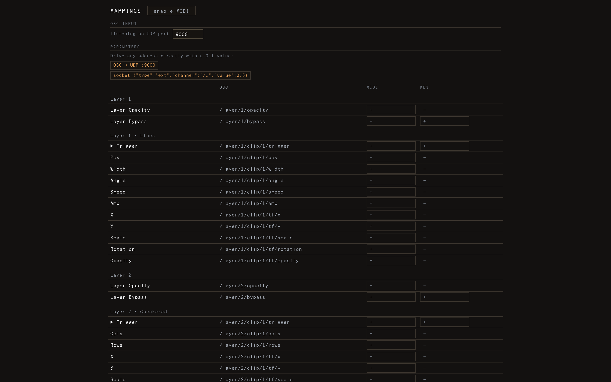

# Mappings

> Control LED Zeppelin live — from a MIDI controller, the keyboard, OSC, or a phone.

The **Mapping** tab is where you wire external controls to the show: trigger a clip, ride a parameter, block a layer, or set the OSC listen port. Open it from the **mapping icon** in the top bar (it opens as a browser tab, like the Inventory). The editor still owns the show; the Mapping tab is just a view onto it, kept in sync.



## Two ways to drive the show

LED Zeppelin has **two parallel control paths**, and you can use both at once:

1. **The canonical OSC address map (always on).** Every layer, clip, trigger, and parameter has a fixed, predictable address — Resolume-style. A controller just sends a `0–1` value to that address; there is **no binding step**. This is how the phone remote works.
2. **Learned MIDI / Key bindings.** When you want a physical knob, fader, pad, or keyboard key to follow a specific target, you **arm** a cell and move the control. The binding is saved in the composition.

The parameter table in the Mapping tab shows both at once: each row lists its **OSC** address (always live) plus a **MIDI** cell and, where it makes sense, a **Key** cell.

## The parameter table

Rows are grouped by **layer · clip**. For each clip you get:

- **Layer Opacity** — `/layer/<n>/opacity`. Absolute (a fader rides it 0–100%). MIDI only.
- **Layer Bypass** — `/layer/<n>/bypass`. On/off, so it takes MIDI **or** a Key. Has a **mode** toggle (see below).
- **▶ Trigger** (per clip) — `/layer/<n>/clip/<m>/trigger`. A value `≥ 0.5` activates that clip. MIDI or Key.
- **Source params** (per clip) — the generator's own parameters, e.g. `/layer/<n>/clip/<m>/<paramKey>`. Continuous params take **MIDI only** (a key can't sweep a value); boolean params also take a **Key**. Color params are not mappable here (one float can't carry a color).
- **Transform** (per clip) — `x`, `y`, `scale`, `rotation`, `opacity`, addressed as `/layer/<n>/clip/<m>/tf/<key>`. MIDI only.

Layer indices are **1-based in deck order**: `/layer/1` is the top deck row. Clip indices `<m>` are 1-based within the layer.

Each row's **OSC** cell is click-to-copy — click it and the address is on your clipboard (it flashes `✓`), ready to paste into TouchOSC, TouchDesigner, or a script.

> If the table says *"add a clip in the editor"*, there's nothing to map yet — add a clip on the [canvas](06-canvas-sources-effects.md) first.

## Binding a MIDI control or key (arm + move)

1. Click a **MIDI** or **Key** cell in the row you want. It arms and shows `move…` (MIDI) or `press…` (Key).
2. **Move the control** — turn the knob, push the fader, hit the pad (MIDI), or **press the key** (Key). LED Zeppelin watches the incoming channels, detects the one that moved most, and binds it.
3. The cell now shows the channel name (`cc7`, `note36`, or the key) with a **live value bar**, and the row label tints to the accent color.

Press **Esc** to cancel an armed cell without binding. Click the **×** in a bound cell to clear it. Re-click a bound cell to re-arm and re-bind.

**Enable MIDI first.** Click **enable MIDI** at the top of the tab (Web MIDI asks for permission the first time). Once granted, it auto-enables on later loads, and hot-plugged controllers are picked up automatically. The status line lists your connected inputs.

**Channel names.** Incoming MIDI becomes external channels: a Control Change is `cc<n>` (e.g. `cc7`), a note is `note<n>` (e.g. `note36`), each normalized to `0–1`. Keyboard keys are `key:<code>` (e.g. `key:KeyA`), shown without the prefix. You don't have to type these — arming and moving the control fills them in.

### Toggle vs. momentary (Layer Bypass)

A bound **Layer Bypass** row shows a small **mode** button you can flip:

- **toggle** — each press flips bypass on ↔ off (rising edge).
- **momentary** — bypassed only while the control is held down.

Triggers always fire on the rising edge (press); layer opacity is always absolute.

## OSC input

OSC arrives over **UDP**. The default listen port is **9000**. Set it live in the **OSC input** section of the Mapping tab: type a port and it rebinds immediately (the daemon closes the old socket and binds the new one). The port is remembered across reloads.

Point any OSC sender — **TouchOSC**, **TouchDesigner**, `oscsend`, a Max/Pd patch — at this machine's IP on that port. Send the canonical address with a single numeric argument; the value is read as a float, clamped to `0–1`, and mapped onto the target's real range (for booleans, `≥ 0.5` = true). Messages can be wrapped in OSC bundles (TouchOSC/TouchDesigner do this) — they're unwrapped and applied immediately.

```
/layer/1/clip/2/trigger        1.0      → activate clip 2 on the top layer
/layer/1/opacity               0.5      → top layer to 50%
/layer/1/clip/2/tf/rotation    0.75     → that clip's rotation, 0..1 across its range
/layer/1/clip/2/speed          0.3      → a source param by its key
/layer/1/bypass                1.0      → block (mute) the top layer
```

There's also a **`/selected/…`** alias that always targets whatever clip is selected in the editor — e.g. `/selected/tf/scale` or `/selected/speed`. Handy for a controller page that should drive "whatever I'm editing right now".

> **Socket alternative.** Anything on the same machine can also send `{"type":"ext","channel":"/…","value":0.5}` over the `/frames` WebSocket — the same path the phone remote uses. The Mapping tab prints both forms for reference.

## The phone remote (control surface)

The phone companion is a standalone page at **`/control/`** on this machine — no install, just a browser. When you launch the daemon it prints the LAN URL (e.g. `http://192.168.1.20:7070/control/`); open it on a phone on the **same Wi-Fi**. (The top bar's **Remote** icon opens the same surface from the editor; it's enabled only while the daemon is running.)

The remote auto-builds from the show:

- One card per layer: a **B** (Block / bypass) button, a **clip-trigger grid** with thumbnails, and an **opacity fader**.
- A **Parameters** section with faders for the params you exposed in the editor (the per-clip cog menu).

Every control sends a canonical OSC address back to the editor, so the phone and a MIDI rig stay in agreement. The surface follows the editor's accent color, and goes dim/disabled when it can't reach the editor — so you never poke a dead control.

## Practical mappings

**Switch a look on a pad.** Lay out your clips, then in the Mapping tab arm the **▶ Trigger** cell for each clip and tap a different pad/key for each. Now one press jumps to that look. Pair with [Scenes](07-scenes.md) for full-rig snapshots.

**Ride a parameter with a knob.** Arm the **MIDI** cell on a source param (e.g. *Speed* or *Scale*) and turn a knob — it now sweeps that param across its range. Continuous params are MIDI/fader territory; for an on/off param a key works too.

**Kill a layer fast.** Bind **Layer Bypass** to a key. Set it to **momentary** for a "blackout while held" stutter, or **toggle** for a latching mute. The same address (`/layer/<n>/bypass`) is the phone's **B** button.

**Tempo from MIDI clock.** If your controller/DAW sends MIDI clock, enabling MIDI also locks the global BPM to it (24 pulses per quarter note) — no mapping needed.

---

_See also: [The canvas — sources, effects & parameter modulation](06-canvas-sources-effects.md) · [Scenes](07-scenes.md) · [Deploying](11-deploying.md)._
