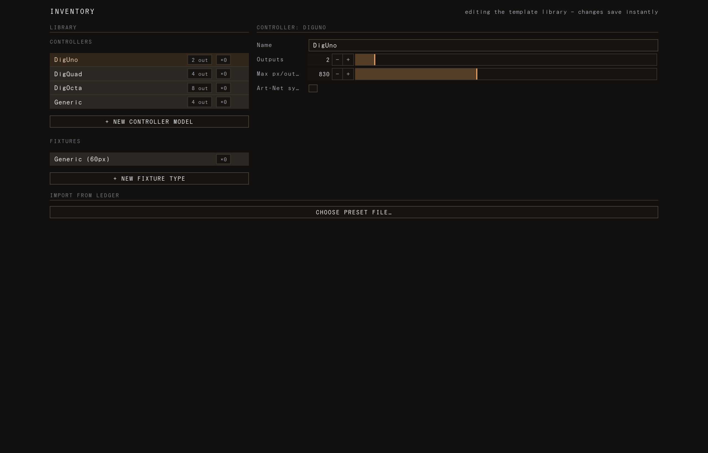

# Importing from LEDger

LEDger is the sibling rig-design tool. You lay out the physical install there —
controllers, LED tubes/strips, and the wiring between them — and export it as a
**preset** file. LED Zeppelin imports that preset and turns it into a live rig:
a **device** per controller and a **fixture** per tube, already wired into the
right output ports and pixel ranges, ready to light.

This page covers what comes across, where to trigger the import, how to assign
controller IPs, and the two rules worth remembering — the import **replaces** your
rig (it is not additive) and it is **undoable** with ⌘Z.

## What a LEDger preset contains

A preset describes the rig, not the visuals:

- **Controllers** → become **devices** (one per controller). The importer keeps
  only controllers that actually drive at least one tube.
- **Tubes / strips** → become **fixtures**, each with its real pixel count and
  colour order from LEDger.
- **Wiring** → the data edges (controller output → first tube → next tube …) set
  each fixture's output **port** and its position in the daisy chain, which in turn
  fixes the contiguous pixel range on that device.
- **Geometry** → each tube's points become a bar (straight runs) or polyline
  (bent runs) on the canvas, and the canvas is sized to the rig's footprint so the
  layout isn't stretched.

A LEDger **fixture type** is created per tube definition in use, so imported tubes
show up in the [Library](05-fixtures-and-inventory.md) with their correct pixel
counts and you can duplicate from them later.

The import is **balanced and limited by what LEDger exports**. Only `strip` and
`controller` instances are imported — anything else (PSUs, decorations, etc.) is
ignored, and you'll see a note saying how many were skipped. If a tube isn't wired
to any controller it still comes in, as an **unassigned** fixture, so the count
reconciles instead of silently dropping it.

## Triggering the import

Import lives **inside the Library window**, not on the top bar. Open the Library
(the box icon in the top bar — it opens as a popup window) and use **import from
ledger → choose preset file** to pick the exported `.json`.

You can also **drag the preset onto the LED Zeppelin window**. Because a LEDger
preset is a rig (not a project or composition), dropping it doesn't load
anything directly — it shows the hint:

> That looks like a LEDger preset — import it from the Library window.

So either drop reminds you of, or you go straight to, the same place: the Library
window's importer.

> Other drops behave differently: a project `.json` loads rig + visuals, a
> composition `.json` loads visuals only, and an ISF shader (`.fs`/`.isf`/`.frag`/`.glsl`)
> becomes a new generator clip. See [Canvas, sources & effects](06-canvas-sources-effects.md).

## Preview and warnings

Once a preset loads, the importer shows a **preview** before anything changes:

- a one-line summary — `N controller(s) · M fixture(s) · total px · canvas W×H`
- a per-controller breakdown — name, output count, total pixels, fixture count
- an **unassigned** line if any tubes came in unwired

Any **warnings** appear here too: a tube with a missing type (it falls back to a
default pixel count so it stays addressable), a tube that fans out to several tubes
(one branch is kept, the rest are dropped with a note), an unwired tube, or ignored
instance kinds. Read these — they tell you exactly what the importer did and didn't
model.

## Assigning controller IPs

LEDger doesn't carry network addresses, so every imported device starts with a
**blank IP**. The importer's **assign controller ips** panel gives you one row per
device — name, IP field, and colour order — plus a sequential **auto-fill**:

1. Type a **base IP** (e.g. `192.168.1.50`).
2. Click **auto-fill sequential** to fill every device row from that base, counting
   up.

A status line tracks `N of M controller(s) need a valid IP`, and **apply import**
stays disabled until every device has a valid IPv4 address. If the address range
runs out before all devices are filled, the importer tells you which controller it
stopped at.

You don't have to use auto-fill — edit any row by hand. Colour order is pre-set per
device from the first tube on it, and you can override it here too.

### IPs carry across re-import

If you re-import the same rig (id-for-id) after editing it in LEDger, the importer
**carries forward the IP and colour order** from each matching device already in
your live rig. Addressing a rig once means a re-import doesn't blank it — you only
re-confirm.

## Applying — it replaces the rig, and it's undoable

Pressing **apply import** first validates the imported rig, then asks you to confirm
the **rig replace**:

> Replace your current rig (X controllers, Y fixtures) with the imported one
> (N controllers, M fixtures)? Your layers & clips are kept; the canvas becomes
> W×H. You can undo this (⌘Z).

Two things to be clear on:

- **It replaces, it is not additive.** Every existing **device** and **fixture** is
  swapped out for the imported rig. To merge two rigs, import the combined layout
  from LEDger rather than importing twice.
- **Your visuals are kept.** Layers and clips stay as they are; only the rig and the
  **canvas size** are adopted (the canvas matches the rig's aspect so the layout
  isn't squished).

The import commits through the same path as any fixture edit — it saves, rebuilds
the sampler/route/output bridge, and refreshes the panels — so the canvas overlay,
the [Output](04-devices-and-scanning.md) list, and the rest of the UI all update at
once.

A successful import is a **single undoable step**: press **⌘Z** to restore your prior
rig and composition. A persistent banner confirms what landed —
`Imported N controllers, M fixtures (total px). Rig replaced — ⌘Z to undo.`

## After import

The imported devices still need to reach their controllers on the network. Head to
the [Output](04-devices-and-scanning.md) panel to verify each device's IP, scan,
and identify, then use [Output & calibration](10-output-and-calibration.md) and the
**Preview** wall button to confirm pixels light where you expect.

_See also: [Fixtures & the Library](05-fixtures-and-inventory.md) ·
[Devices & scanning](04-devices-and-scanning.md) ·
[Output & calibration](10-output-and-calibration.md)._
